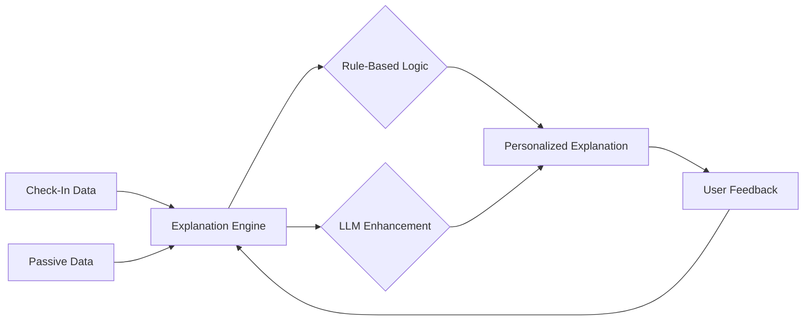
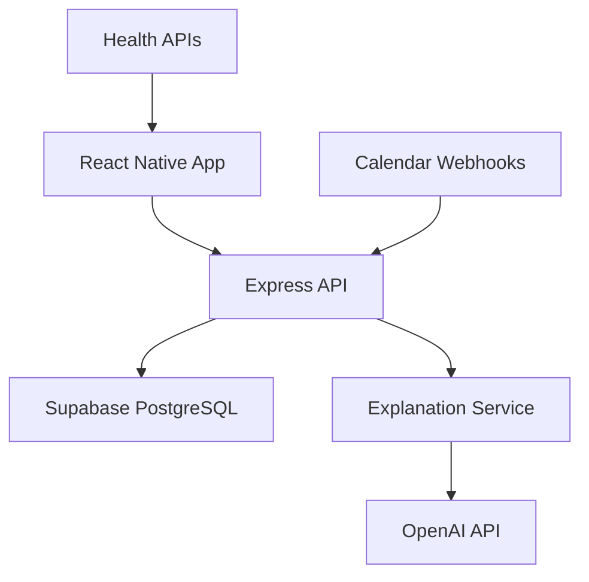
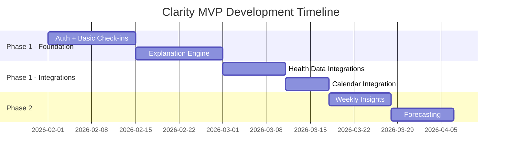

# Clarity - Daily Energy & Recovery Companion App

## Project Overview

**Clarity** is a mobile companion app designed to help users understand their daily energy fluctuations through simple check-ins and personalized explanations. Unlike traditional health tracking apps that overwhelm users with metrics and dashboards, Clarity prioritizes **clarity, minimal friction, and trust**.

> [!IMPORTANT]
> The app should feel like *"Someone who understands my body and helps me make today easier"* — not a clinical tracking tool.

---

## Problem Statement

Millions of people feel chronically tired, mentally drained, or inconsistent in energy despite sleeping, exercising, and "doing the right things."

**Existing health apps fail because they:**
- Surface metrics without meaning
- Require high effort (manual logging, complex dashboards)
- Focus on optimization, not restoring baseline well-being
- Do not explain *why* today feels worse than yesterday

**Core Problem:** Users experience daily energy fluctuations but lack clear, actionable explanations and simple guidance to feel better today.

---

## Product Vision

Create a daily companion app that:
- **Explains** why users feel the way they do
- **Predicts** energy dips before they happen
- **Recommends** small, realistic actions
- **Requires** less than one minute per day

**Core Value Proposition:**
```
Clear explanations + simple actions → better days
```

This product does not compete on tracking. It competes on **interpretation and clarity**.

---

## Target Users

### Primary ICP
- Ages 25–55
- Busy adults, knowledge workers, parents
- Generally healthy but feel "off," tired, or inconsistent
- Overwhelmed by health data but still motivated to feel better

### Secondary ICP
- Burnout-prone professionals
- Remote and hybrid workers
- Users of wearables who feel data-rich but insight-poor

### Explicitly NOT Targeting
- Elite athletes
- Medical patients
- Biohacking or quantified-self enthusiasts

---

## Tech Stack

| Layer | Technology |
|-------|------------|
| **Frontend** | React Native with Expo |
| **Backend** | Node.js with Express |
| **Database & Auth** | Supabase (PostgreSQL + Auth) |
| **LLM Integration** | OpenAI API (or similar) for explanation generation |
| **Push Notifications** | Expo Notifications |
| **Health Data** | Apple Health (iOS) & Google Health Connect (Android) via Expo modules |

---

## Core MVP Features

### 1. Authentication & Onboarding

- Email/password + OAuth via Supabase Auth
- Simple onboarding explaining the app's purpose
- Permission requests for notifications/health data

---

### 2. Daily Energy Dashboard (Primary Screen)

The single primary screen displays:

| Element | Description |
|---------|-------------|
| **Energy Score** | 1-10 scale |
| **Explanation** | Plain-English, 1-2 sentences |
| **Actions** | 2-3 recommended activities |

**Example Display:**

```
Energy Today: 6.5 / 10

You slept enough hours, but later than usual, and yesterday involved 
prolonged mental effort. This combination often leads to a mid-day 
energy dip.

Try today:
• Delay caffeine until 9:30am
• Take a 10-minute walk before noon
```

> [!NOTE]
> No charts required to get value. Clean, calming UI only.

---

### 3. Daily Check-In System

All inputs are **structured (no free text)** and take **<60 seconds total**.

#### Morning Check-In (Required)
| Input | Type |
|-------|------|
| "How rested do you feel?" | Scale: 1-10 |
| "How motivated to start the day?" | Low / Medium / High |

#### Mid-Day Pulse (Optional)
Triggered during predicted dip window (default: 1-3pm)

| Input | Type |
|-------|------|
| "How's your energy right now?" | Low / OK / High |
| "Which describes your state?" | Mentally drained / Physically tired / Distracted / Fine |

#### Evening Reflection (Required)
| Input | Type |
|-------|------|
| "What drained you most today?" | Poor sleep / Work / Physical exertion / Emotional stress / Poor meals / Unknown |
| "How did today compare to expectations?" | Better / Same / Worse |

---

### 4. Passive Data Integration (Opt-In)

All integrations are optional, permission-based, and transparent.

#### Sleep Data
- **Sources:** Apple Health (iOS), Google Health Connect (Android)
- **Data Used:** Total duration, bedtime/wake time, sleep consistency
- **Fallback:** Phone lock/unlock patterns, alarm usage

#### Calendar Integration
- **Sources:** Google Calendar, Apple Calendar
- **Data Used:** Meeting times, density, gaps between meetings, late-day meetings
- **Not Accessed:** Titles, attendees, notes, content

#### Movement Data
- **Sources:** Apple Health, Google Health Connect, device motion sensors
- **Data Used:** Step count ranges, sedentary blocks, movement presence

#### Binary Habit Flags
Collected via 1-tap prompts:
- Late caffeine (after cutoff): Yes / No
- Skipped/delayed meals: Yes / No
- Alcohol previous evening: Yes / No

---

### 5. Explanation Engine



- **Hybrid System:** Rule-based + LLM
- **Personal Baseline:** Established after 5-7 days
- **Personalization:** Generates explanations from individual data patterns
- **Transparency:** Includes uncertainty when appropriate

---

### 6. Weekly Insights

- Top 2 energy drains identified
- Top 2 energy supports identified  
- One weekly experiment suggestion

---

### 7. Feedback Loop

- Simple "Did this match?" prompt (Yes / Not really)
- Displayed after explanations
- Used to calibrate model over time

---

## Key Implementation Requirements

### Privacy-First Design

| Requirement | Implementation |
|-------------|----------------|
| Clear consent | Explicit flows for each data source |
| Easy opt-out | One-tap removal from any integration |
| No medical terms | Plain language only |
| Transparency | Clear data usage explanations |

### Minimalist UX

| Requirement | Target |
|-------------|--------|
| Primary screens | One main energy screen |
| Check-in duration | <10 seconds each |
| Dashboard complexity | No charts or complex visualizations |
| Design aesthetic | Calming colors and typography |

### Backend Architecture



- User data stored in Supabase PostgreSQL
- Time-series data for check-ins and passive signals
- Explanation generation service (Node.js + LLM)
- Webhooks for calendar integrations

### Mobile-Specific Considerations

- Background sync for health data
- Local notification scheduling for check-ins
- Offline support for basic check-ins
- Battery-efficient sensor usage

---

## Success Metrics

| Metric | Target |
|--------|--------|
| Daily Active Users / Weekly Retention | ≥35-40% |
| Average Daily Usage Time | <90 seconds |
| Explanation Feedback Match Rate | Track improvement |
| Recommendation Follow-through Rate | Track improvement |

---

## Phase 1 (MVP) Exclusions

> [!CAUTION]
> The following are **explicitly excluded** from MVP:

- ❌ Detailed biometric dashboards
- ❌ Calorie/macronutrient tracking
- ❌ Social/community features
- ❌ Medical diagnostics or coaching

---

## Special Considerations

- The app should feel like a **helpful companion** — not a tracking tool
- Explanations should feel **human**, not robotic
- **Uncertainty** should be communicated honestly
- All recommended actions must be **immediately achievable**

---

## Deliverables

1. **Expo-based React Native app** for iOS & Android
2. **Node.js backend API** with Supabase integration
3. **Admin dashboard** for monitoring feedback/model performance
4. **Documentation** for setup, deployment, and data flow

---

## Timeline Priority



### Phase 1 Priority Order:
1. Auth + Basic check-ins + Explanation engine
2. Health data integrations
3. Calendar integration

### Phase 2:
4. Weekly insights + forecasting

---

## Next Steps

1. Set up Expo React Native project structure
2. Configure Supabase project (database schema + auth)
3. Design and implement authentication flows
4. Build the Daily Energy Dashboard UI
5. Implement check-in system components
6. Set up Node.js backend with Express
7. Integrate health data APIs
8. Build the explanation engine service
